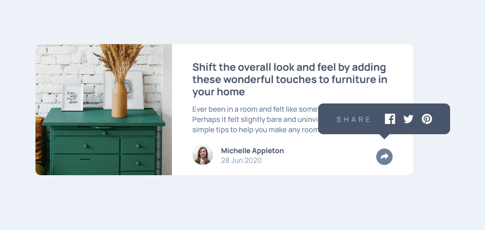

# Frontend Mentor - Article preview component solution

This is a solution to the [Article preview component challenge on Frontend Mentor](https://www.frontendmentor.io/challenges/article-preview-component-dYBN_pYFT). Frontend Mentor challenges help you improve your coding skills by building realistic projects. 

## Table of contents

- [Overview](#overview)
  - [The challenge](#the-challenge)
  - [Screenshot](#screenshot)
  - [Links](#links)
- [My process](#my-process)
  - [Built with](#built-with)
  - [What I learned](#what-i-learned)
- [Author](#author)

## Overview

### The challenge

Users should be able to:

- View the optimal layout for the component depending on their device's screen size
- See the social media share links when they click the share icon

### Screenshot



### Links

- [See the solution on Frontend Mentor](https://www.frontendmentor.io/solutions/article-preview-using-scss-vanilla-js-mobile-first-hgZHRsGr1)
- [See Live Site](https://article-preview-fm.vercel.app/)

## My process

### Built with

- Semantic HTML5 markup
- CSS custom properties
- Flexbox
- Mobile-first workflow
- SCSS
- BEM Methodology
- Vanilla JavaScript

### What I learned

This design was relatively simple to recreate. The most challenging part was the positionig of 'Share to social media' modal in both mobile and desktop layout.

In mobile layout, the modal is displayed on top of the card, but underneath the Share button. I added a higher `z-index` to the button to achieve this.

```scss
/* Share button */
.preview__attribution__share {
    position: relative;
    /* other styles */
    z-index: 2;
}

/* Modal */
.preview__modal {
    position: absolute;
    /* other styles */
    z-index: 1;
}
```

In desktop layout, I wanted to ensure that the modal is centered above the share button, as it is in the design. To achieve this, I offset it fro the right by a value of the container padding and half the width of the share button, then use the `transform` property to center it:

```scss
.preview__modal {
  @include breakpoint-up(medium) {
        bottom: 5rem;
        left: unset;
        right: 3.5rem; /*container padding + half the width of share button */
        transform: translateX(50%);
  }
}
```

The modal is displayed by clicking the share button (it is also keyboard-accessible with custom focus state). I wanted to make sure that it can be closed both by clicking the share button again and by clicking anywhere outside the modal.

```js
body.addEventListener('click', (e) => {
    if (shareBtn.classList.contains('active') && e.target !== modal && !e.target.closest('.js-modal')) {
        hideModal();
    } 
})
```
Inside the modal, I used `<button>` elements with `aria-label`s as containers for social media icons, assuming that they would open a modal to share content to social media platforms. However, if after clicking on one of the icons, the user was redirected to those social media platforms, anchor tags would be more appropriate.

I also had to adjust the design slightly to fit screens smaller than 375px - elements in the attribution part could not all be displayed in one line without distortion. I decided to hide the author's image and 'share' text on the modal by default, and only display them on screens from 375px.

```scss
.preview__attribution__img {
    display: none;

    @include breakpoint-up(small) {
        display: block;
        height: 2.5rem;
        width: 2.5rem;
        margin-right: 1rem;
        border-radius: 50%;
    }
}
```

## Author

- Frontend Mentor - [@AgataLiberska](https://www.frontendmentor.io/profile/AgataLiberska)
